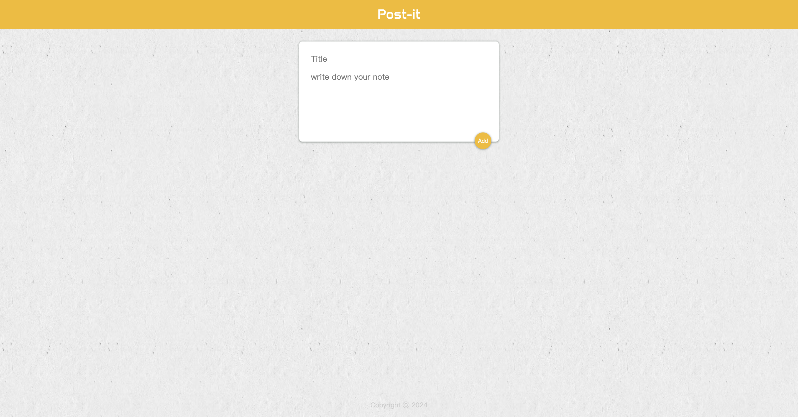
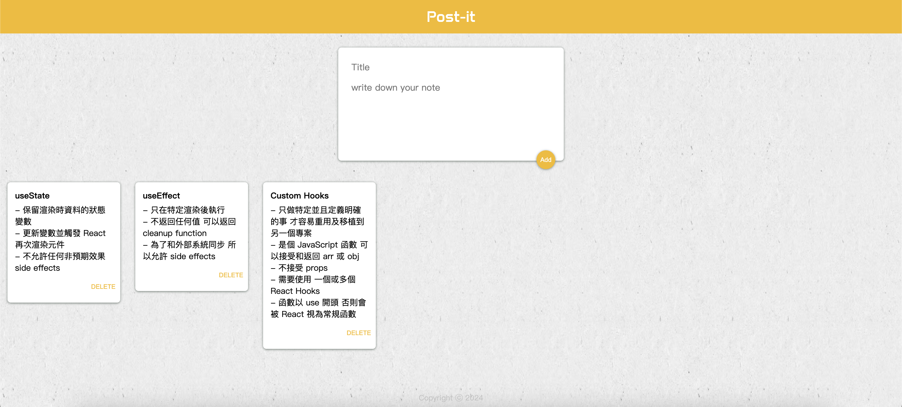

# Post-it - build with React

This is a exercise to build Post-it with React. The user can write down the note, and the data will store data in local storage.

- Screenshot:
  
  

## Built with

- React

## Runs the app

```Shell
npm start
```

- Runs the app in the development mode.
- Open [http://localhost:3000](http://localhost:3000) to view it in your browser.
- The page will reload when you make changes.
- You may also see any lint errors in the console.

## Learn More

You can learn more in the [Create React App documentation](https://facebook.github.io/create-react-app/docs/getting-started).

To learn React, check out the [React documentation](https://reactjs.org/).

## Author

- The Complete 2024 Web Development Bootcamp by Dr. Angela Yu
- YAL

## Acknowledgments

- Ivy&Ciao
- Dr. Angela
- Mr. Jonas
- and me.
